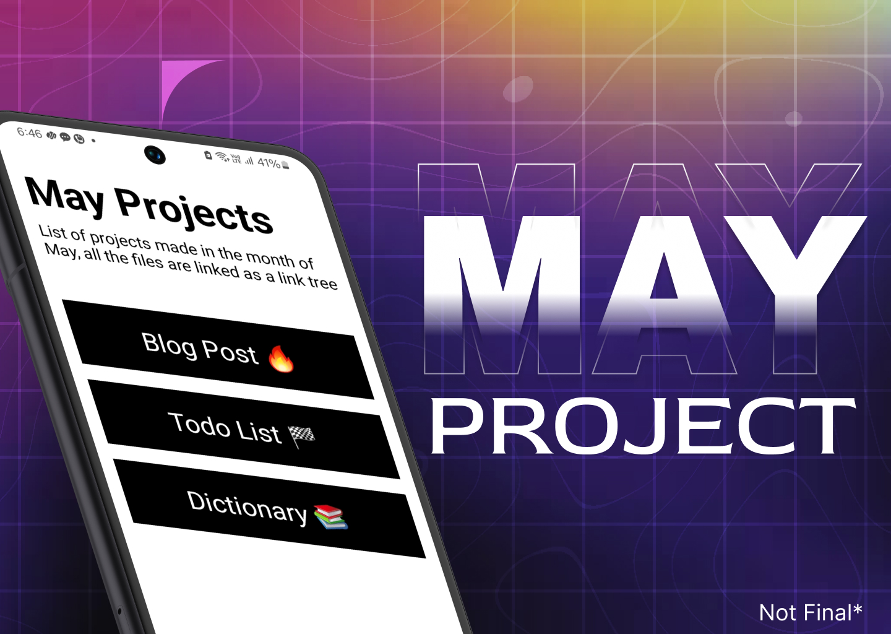

<h1>May Project 🚀: </h1> 

This project is just a newbie react native developer trying to learn react native through project based learning📚, for years now i was stuck in tutorial hell and couldn't build any projects on my own so this time i took a different approach than just watching tutorials, i just dived in without knowing anything about the fundamentals and i just started building basic apps in a way i could learn react native. This project is inspired from Devember from NotJustDev, where Vadim made 24 projects in the month of December 2023, in the aim of teaching other aspiring react native devs👨‍💻. Based on that i created 5 (Not finalized) apps, where i learnt  concepts of react native📱. 
